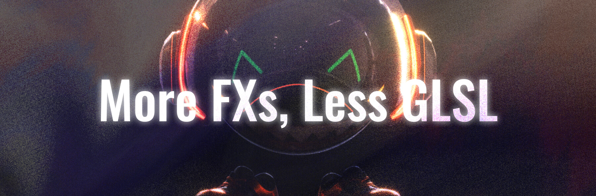
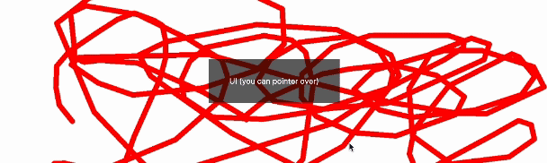

`use-shader-fx` is a library designed to easily implement shader effects such as fluid simulations and noise. It relies on [react-three-fiber](https://github.com/pmndrs/react-three-fiber) and has been designed with performance control in mind, especially when combined with [drei](https://github.com/pmndrs/drei).

For details on each FX, please refer to Storybook
👉 [Storybook](https://use-shader-fx-stories.vercel.app/) 👈

```bash
npm install @funtech-inc/use-shader-fx
```

### Click for the demo! 🤩

<table>
  <tr>
    <td><a href="https://use-shader-fx.vercel.app/"></a></td>
    <td><a href="https://use-shader-fx.vercel.app/cream"></a></td>
    <td><a href="https://use-shader-fx.vercel.app/useMorphParticles"></a></td>
	 <td><a href="https://use-shader-fx.vercel.app/obscurus"></a></td>
  </tr>
  <tr>
	<td><a href="https://particles-demo-green.vercel.app/"></a></td>
   <td><a href="https://use-shader-fx.vercel.app/useWobble3D"></a></td>
	<td><a href="https://romanticism.vercel.app/"></a></td>
  </tr>
</table>

# Hooks Index

### FXs

<table>
<tr>
<th><strong>effects</strong></th>
<td><a href="https://use-shader-fx-stories.vercel.app/?path=/docs/effects-usemotionblur--docs">useMotionBlur</a>, <a href="https://use-shader-fx-stories.vercel.app/?path=/docs/effects-usesimpleblur--docs">useSimpleBlur</a>, <a href="https://use-shader-fx-stories.vercel.app/?path=/docs/effects-usewave--docs">useWave</a></td>
</tr>

<tr>
<th><strong>interactions</strong></th>
<td><a href="https://use-shader-fx-stories.vercel.app/?path=/docs/interactions-usebrush--docs">useBrush</a>, <a href="https://use-shader-fx-stories.vercel.app/?path=/docs/interactions-usefluid--docs">useFluid</a>, <a href="https://use-shader-fx-stories.vercel.app/?path=/docs/interactions-useripple--docs">useRipple</a></td>
</tr>

<tr>
<th><strong>misc</strong></th>
<td><a href="https://use-shader-fx-stories.vercel.app/?path=/docs/misc-usechromakey--docs">useChromaKey</a>, <a href="https://use-shader-fx-stories.vercel.app/?path=/docs/misc-useblank--docs">useBlank</a></td>
</tr>

<tr>
<th><strong>noises</strong></th>
<td><a href="https://use-shader-fx-stories.vercel.app/?path=/docs/noises-usecolorstrata--docs">useColorStrata</a>, <a href="https://use-shader-fx-stories.vercel.app/?path=/docs/noises-usemarble--docs">useMarble</a>, <a href="https://use-shader-fx-stories.vercel.app/?path=/docs/noises-usenoise--docs">useNoise</a></td>
</tr>

<tr>
<th><strong>utils</strong></th>
<td><a href="https://use-shader-fx-stories.vercel.app/?path=/docs/utils-usealphablending--docs">useAlphaBlending</a>, <a href="https://use-shader-fx-stories.vercel.app/?path=/docs/utils-useblending--docs">useBlending</a>, <a href="https://use-shader-fx-stories.vercel.app/?path=/docs/utils-usebrightnesspicker--docs">useBrightnessPicker</a>, <a href="https://use-shader-fx-stories.vercel.app/?path=/docs/utils-usecovertexture--docs">useCoverTexture</a>, <a href="https://use-shader-fx-stories.vercel.app/?path=/docs/utils-useduotone--docs">useDuoTone</a>, <a href="https://use-shader-fx-stories.vercel.app/?path=/docs/utils-usefxblending--docs">useFxBlending</a>, <a href="https://use-shader-fx-stories.vercel.app/?path=/docs/utils-usefxtexture--docs">useFxTexture</a>, <a href="https://use-shader-fx-stories.vercel.app/?path=/docs/utils-usehsv--docs">useHSV</a></td>
</tr>

<tr>
<th><strong><a href="#3D">3D</a></strong></th>
<td><a href="https://use-shader-fx-stories.vercel.app/?path=/docs/3d-usemorphparticles--docs">useMorphParticles</a>, <a href="https://use-shader-fx-stories.vercel.app/?path=/docs/3d-usewobble3d--docs">useWobble3D</a></td>
</tr>

</table>
※ The hook with `~~Texutre` calculates the texture resolution and canvas resolution and covers the texture.

### Misc

<table>
<tr>
<th><strong>misc</strong></th>
<td><a href="#usebeat">useBeat</a>, <a href="#usefpslimiter">useFPSLimiter</a>, <a href="#usepointer">usePointer</a>, <a href="#usedomsyncer">useDomSyncer</a></td>
</tr>
</table>

# Usage

From each `fxHooks`, you can receive [`updateFx`, `setParams`, `fxObject`] in array format. `HooksProps` are objects that are different for each hook and contain values such as `size`, `dpr` ... etc.

1. `updateFx` - A function to be invoked inside `useFrame`, returning a `THREE.Texture`.
2. `setParams` - A function to refresh the parameters, beneficial for performance tweaking, etc.
3. `fxObject` - An object that holds various FX components, such as scene, camera, mesh, renderTarget, and `output`(final rendered texture).
4. `HooksProps` - `size`,`dpr`,`samples`,`isSizeUpdate`,`uniforms`,`onBeforeCompile`but may also be hook specific. ※ `isSizeUpdate` : Whether to `setSize` the FBO when updating size or dpr(default : `false`).

```js
const [updateFx, setParams, fxObject] = useSomeFx(HooksProps);
```

invoke `updateFx` in `useFrame`. The first argument receives the RootState from `useFrame`, and the second one takes `HookPrams`. Each fx has its `HookPrams`, and each type is exported.

```js
useFrame((props) => {
   const texture = updateFx(props, HookPrams, customParams);
   const main = mainShaderRef.current;
   if (main) {
      main.u_bufferTexture = texture;
   }
});
```

### Starter template with Next.js + TypeScript 🎨

<a href="https://github.com/FunTechInc/blankcanvas"></a>

[blankcanvas](https://github.com/FunTechInc/blankcanvas)

## The simplest example

This is the simplest example!

```tsx
import * as THREE from "three";
import { useRef } from "react";
import { useFrame, useThree } from "@react-three/fiber";
import { useFluid } from "@funtech-inc/use-shader-fx";

export const Home = () => {
   const ref = useRef<THREE.ShaderMaterial>(null);
   const { size, viewport } = useThree();
   const [updateFluid, , { output }] = useFluid({ size, dpr: viewport.dpr });
   useFrame((props) => updateFluid(props));

   return (
      <mesh>
         <planeGeometry args={[2, 2]} />
         <shaderMaterial
            ref={ref}
            vertexShader={`
					varying vec2 vUv;
						void main() {
							vUv = uv;
							gl_Position = vec4(position, 1.0);
						}
						`}
            fragmentShader={`
						precision highp float;
						varying vec2 vUv;
						uniform sampler2D u_fx;

						void main() {
							vec2 uv = vUv;
							gl_FragColor = texture2D(u_fx, uv);
						}
					`}
            uniforms={{
               u_fx: { value: output },
            }}
         />
      </mesh>
   );
};
```

## Integrate with r3f scenes.

You can use `r3f/createPortal` to make some mesh render off-screen. All that remains is to combine the generated textures with FX!

```tsx
import * as THREE from "three";
import { useMemo, useRef, useState } from "react";
import { useFrame, useThree, createPortal } from "@react-three/fiber";
import { useNoise, useSingleFBO } from "@hmng8/use-shader-fx";

function Box(props: any) {
   // This reference will give us direct access to the mesh
   const meshRef = useRef<THREE.Mesh>();
   // Set up state for the hovered and active state
   const [hovered, setHover] = useState(false);
   const [active, setActive] = useState(false);
   // Subscribe this component to the render-loop, rotate the mesh every frame
   useFrame((state, delta) => {
      meshRef.current!.rotation.x += delta;
      meshRef.current!.rotation.y -= delta;
   });
   // Return view, these are regular three.js elements expressed in JSX
   return (
      <mesh
         {...props}
         ref={meshRef}
         scale={active ? 2 : 1.5}
         onClick={(event) => setActive(!active)}
         onPointerOver={(event) => setHover(true)}
         onPointerOut={(event) => setHover(false)}>
         <boxGeometry args={[1, 1, 1]} />
         <meshStandardMaterial color={hovered ? "hotpink" : "orange"} />
      </mesh>
   );
}

export const Home = () => {
   const ref = useRef<THREE.ShaderMaterial>(null);
   const { size, viewport, camera } = useThree();
   const [updateNoise, , { output }] = useNoise({
      size,
      dpr: viewport.dpr,
   });

   // This scene is rendered offscreen
   const offscreenScene = useMemo(() => new THREE.Scene(), []);

   // create FBO for offscreen rendering
   const [boxView, updateRenderTarget] = useSingleFBO({
      scene: offscreenScene,
      camera,
      size,
      dpr: viewport.dpr,
      samples: 4,
   });

   useFrame((props) => {
      updateNoise(props);
      updateRenderTarget(props.gl);
   });

   return (
      <>
         {createPortal(
            <mesh>
               <ambientLight intensity={Math.PI} />
               <spotLight
                  position={[10, 10, 10]}
                  angle={0.15}
                  penumbra={1}
                  decay={0}
                  intensity={Math.PI}
               />
               <pointLight
                  position={[-10, -10, -10]}
                  decay={0}
                  intensity={Math.PI}
               />
               <Box position={[-1.5, 0, 0]} />
               <Box position={[1.5, 0, 0]} />
            </mesh>,
            offscreenScene
         )}
         <mesh>
            <planeGeometry args={[2, 2]} />
            <shaderMaterial
               ref={ref}
               transparent
               vertexShader={`
					varying vec2 vUv;
						void main() {
							vUv = uv;
							gl_Position = vec4(position, 1.0);
						}
						`}
               fragmentShader={`
						precision highp float;
						varying vec2 vUv;
						uniform sampler2D u_fx;
						uniform sampler2D u_texture;

						void main() {
							vec2 uv = vUv;
							vec3 noiseMap = texture2D(u_fx, uv).rgb;
							vec3 nNoiseMap = noiseMap * 2.0 - 1.0;
							uv = uv * 2.0 - 1.0;
							uv *= mix(vec2(1.0), abs(nNoiseMap.rg), .6);
							uv = (uv + 1.0) / 2.0;
							gl_FragColor = texture2D(u_texture, uv);
						}
					`}
               uniforms={{
                  u_texture: { value: boxView.texture },
                  u_fx: { value: output },
               }}
            />
         </mesh>
      </>
   );
};
```

# Performance

You can control the `dpr` using the `PerformanceMonitor` from [drei](https://github.com/pmndrs/drei). For more details, please refer to the [scaling-performance](https://docs.pmnd.rs/react-three-fiber/advanced/scaling-performance) of r3f.

```js
export const Fx = () => {
   const [dpr, setDpr] = useState(1.5);
   return (
      <Canvas dpr={dpr}>
         <PerformanceMonitor
            factor={1}
            onChange={({ factor }) => {
               console.log(`dpr:${dpr}`);
               setDpr(Math.round((0.5 + 1.5 * factor) * 10) / 10);
            }}>
            <Suspense fallback={null}>
               <Scene />
            </Suspense>
            <Perf position={"bottom-right"} minimal={false} />
         </PerformanceMonitor>
      </Canvas>
   );
};
```

By using the `PerformanceMonitor`, you can subscribe to performance changes with `usePerformanceMonitor`. For more details, refer to [drei](https://github.com/pmndrs/drei#performancemonitor).

With `setParams` received from `fxHooks`, it's possible to independently control high-load items such as iteration counts.

```js
usePerformanceMonitor({
   onChange({ factor }) {
      setParams({
         pressure_iterations: Math.round(20 * factor),
      });
   },
});
```

When using some expensive FX (such as `useFluid`), lowering the `dpr` of the FBO of that FX can improve performance.

```js
const [updateFx, setParams, fxObject] = useSomeFx({ size, dpr: 0.01 });
```

Also, you can make more detailed adjustments by passing an object to `dpr` instead of `number`.

```ts
type Dpr =
   | number
   | {
        /** you can set whether `dpr` affects `shader`. default : `false` */
        shader?: false | number;
        /** you can set whether `dpr` affects `fbo`. default : `false` */
        fbo?: false | number;
     };
```

# Misc

## useDomSyncer

The second argument contains the dependency array that updates the DOM. For example, you can pass a `pathname` when navigating pages.

```tsx
const [updateDomSyncer, setDomSyncer, domSyncerObj] = useDomSyncer(
   { size, dpr },
   [state]
);

useLayoutEffect(() => {
   if (state === 0) {
      domArr.current = [...document.querySelectorAll(".item")!];
   } else {
      domArr.current = [...document.querySelectorAll(".item2")!];
   }
   setDomSyncer({
      // Because DOM rendering and React updates occur asynchronously, there may be a lag between updating dependent arrays and setting DOM arrays. That's what the Key is for. If the dependent array is updated but the Key is not, the loop will skip and return an empty texture. By updating the timing key when DOM acquisition is complete, you can perfectly synchronize DOM and Mesh updates.updateKey must be a unique value for each update, for example `performance.now()
      updateKey: performance.now(),
      dom: domArr.current,
      boderRadius: [...Array(domArr.current.length)].map((_, i) => i * 50.0),
      onIntersect: [...Array(domArr.current.length)].map((_, i) => (entry) => {
         if (entry.isIntersecting && !domSyncerObj.isIntersecting(i, true)) {
            // some callback
         }
      }),
   });
}, [state]);

const [, copyTexture] = useCopyTexture(
   { scene: fxTextureObj.scene, camera: fxTextureObj.camera, size, dpr },
   domArr.current.length
);

useFrame((props) => {
   const syncedTexture = updateDomSyncer(props, {
      texture: [...Array(domArr.current.length)].map((_, i) => {
         if (domSyncerObj.isIntersecting(i, false)) {
            textureRef.current = updateFxTexture(props, {
               map: someFx,
               texture0: someTexture,
            });
            return copyTexture(props.gl, i);
         }
      }),
   });
});
```

`domSyncerObj` contains an isIntersecting function that returns the DOM intersection test
The boolean will be updated after executing the `onIntersect` function.

```tsx
type DomSyncerObject = {
   scene: THREE.Scene;
   camera: THREE.Camera;
   renderTarget: THREE.WebGLRenderTarget;
   output: THREE.Texture;
   /**
    * A function that returns a determination whether the DOM intersects or not.
    * The boolean will be updated after executing the onIntersect function.
    * @param index - Index of the dom for which you want to return an intersection decision. -1 will return the entire array.
    * @param once - If set to true, it will continue to return true once crossed.
    */
   isIntersecting: IsIntersecting;
   /** target's DOMRect[] */
   DOMRects: DOMRect[];
   /** target's intersetions boolean[] */
   intersections: boolean[];
   /** You can set callbacks for when at least one DOM is visible and when it is completely hidden. */
   useDomView: UseDomView;
};
```

`DomSyncerParams` can be passed the `onIntersect` function.

```tsx
type DomSyncerParams = {
   /** DOM array you want to synchronize */
   dom?: (HTMLElement | Element | null)[];
   /** Texture array that you want to synchronize with the DOM rectangle */
   texture?: THREE.Texture[];
   /** default:0.0[] */
   boderRadius?: number[];
   /** the angle you want to rotate */
   rotation?: THREE.Euler[];
   /** Array of callback functions when crossed */
   onIntersect?: ((entry: IntersectionObserverEntry) => void)[];
   /** Because DOM rendering and React updates occur asynchronously, there may be a lag between updating dependent arrays and setting DOM arrays. That's what the Key is for. If the dependent array is updated but the Key is not, the loop will skip and return an empty texture. By updating the timing key when DOM acquisition is complete, you can perfectly synchronize DOM and Mesh updates. */
   updateKey?: Key;
};
```

`updateKey` : Because DOM rendering and React updates occur asynchronously, there may be a lag between updating dependent arrays and setting DOM arrays. That's what the Key is for. If the dependent array is updated but the Key is not, the loop will skip and return an empty texture. By updating the timing key when DOM acquisition is complete, you can perfectly synchronize DOM and Mesh updates.

## usePointer

When given the `pointer` vector2 from r3f's `RootState`, it generates an update function that returns {currentPointer, prevPointer, diffPointer, isVelocityUpdate, velocity}.
You can also add `lerp` (0~1, lerp intensity (0 to less than 1) , default: 0)

```js
const updatePointer = usePointer(lerp);

const { currentPointer, prevPointer, diffPointer, isVelocityUpdate, velocity } =
   updatePointer(pointer);
```

You can override the pointer process by passing `pointerValues` to `updateFx` in the `useFrame`.

```ts
useFrame((props) => {
   const pointerValues = updatePointer(props.pointer);
   updateBrush(props, {
      pointerValues: pointerValues,
   });
});
```

## useBeat

Time-sensitive hooks such as `useNoise` and `useMarble` accept `beat`.
The second argument can be `easing`.
easing functions are referenced from https://github.com/ai/easings.net , default : "easeOutQuart"

```ts
const beting = useBeat(bpm, "easeOutQuad");
useFrame((props) => {
   const { beat, hash } = beting(props.clock);
   updateMarble(props, {
      beat: beat,
   });
});
```

```ts
type BeatValues = {
   beat: number;
   floor: number;
   fract: number;
   /** unique hash specific to the beat */
   hash: number;
};
```

## useFPSLimiter

Allows you to skip FX that do not need to be processed at 60 FPS.

```ts
const limiter = useFPSLimiter(30);
useFrame((props) => {
   if (!limiter(props.clock)) {
      return;
   }
});
```

## useCopyTexture

Generate an FBO array to copy the texture.

```tsx
const [renderTargets, copyTexture] = useCopyTexture(UseFboProps, length);
copyTexture(gl, index); // return texture
```

# 3D

The `3D` series has a set of exported hooks, each with `Create`, like `useCreateWobble3D`, which can be used as a texture, but also to add `object3D` as a `primitive` to an r3f scene. It is also possible to add `object3D` as a `primitive` to an r3f scene.

```tsx
const [updateWobble, wobble] = useCreateWobble3D({
   baseMaterial: THREE.MeshPhysicalMaterial,
   materialParameters: {
      roughness: 0.0,
      transmission: 1,
      thickness: 1,
   },
});
useFrame((props) => updateWobble(props));
return (
   <mesh>
      <Environment preset="warehouse" background />
      <primitive object={wobble.mesh} />
   </mesh>
);
```

👉 [wobble3D demo](https://use-shader-fx.vercel.app/useWobble3D) 👈

👉 [morphParticles demo](https://use-shader-fx.vercel.app/useMorphParticles) 👈

# useBlank

By default, it is a blank canvas with nothing drawn on it. You can customise the shaders using `onBeforeCompile`.

Fragment shaders have `uTexture`,`uBackbuffer`,`uTime`,`uPointer` and `uResolution` as default uniforms.

```tsx
const [updateBlank, _, { output: blank, material }] = useBlank({
   size,
   dpr: viewport.dpr,
   uniforms: {
      hoge: { value: 0 },
   },
   onBeforeCompile: useCallback((shader: THREE.Shader) => {
      shader.fragmentShader = shader.fragmentShader.replace(
         "#usf uniforms",
         "uniform float hoge;"
      );
      shader.fragmentShader = shader.fragmentShader.replace(
         "#usf main",
         `usf_FragColor=vec4(vec3(1.,hoge,1.),1.);`
      );
   }, []),
});
useFrame((props) => {
   updateBlank(
      props,
      {},
      {
         hoge: Math.sin(props.clock.getElapsedTime()),
      }
   );
});
```

※ `usf_FragColor` overrides `gl_FragColor`
※ `usf_Position` overrides `gl_Position`
